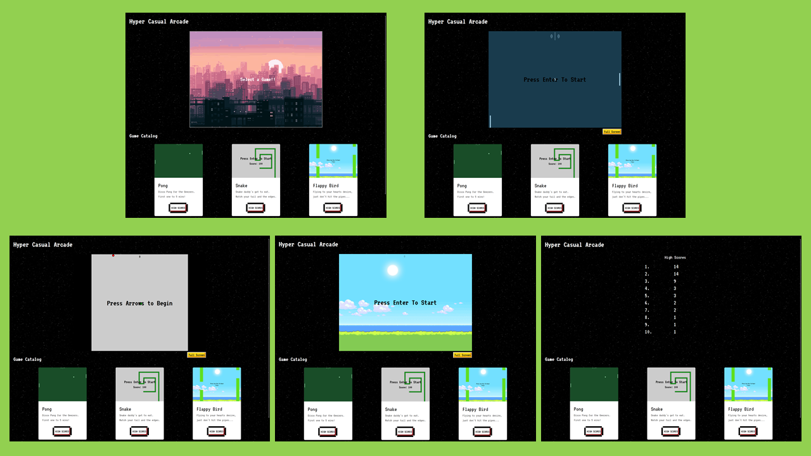

# Hyper Casual Arcade
This online arcade was created as a testing playground for using vanilla javascript to code arcade games from scratch. At the moment the games included are pong, snake, and flappy bird. The fontend interface was developed using React. Try to get a high score and have fun! :snake:

<p align="center">
  
</p>

# Setup
To run this arcade locally simply clone the repo and run the follow
```
npm install
```

and then 
```
npm start
```
# Notes
This project doesn't have a backend and uses local storage to save the highscores. This makes deployment easy and the app very quick, but scores do not carry from one browser to another. Adding a database may be included in future releases.

# Special accknowledgements
* [Web Dev Simplified](https://www.youtube.com/channel/UCFbNIlppjAuEX4znoulh0Cw), for much of the game logic
* [Matthew Shields](https://codepen.io/MatthewShields/pen/pwrXpV), for the cool 8-bit buttons
